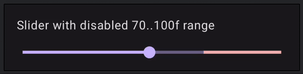
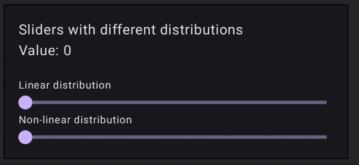

# Mosaic Slider
Mosaic Slider is an "upgrade" from the Material Slider provided by Google. The API is very similar, but allows more  customizations that might be useful to the end users. 

Mosaic Slider features includes:

- Customisable thumb
- Customisable track (Using `Modifiers`)
- Ability to set disabled ranges
- Ability to provide custom **Values Distributions** to controll how user interacts with the slider


## Installation
The artifact is published on Maven Central, make sure you have this repository configured in your `settings.gradle` or its alternative

```kotlin
dependencyResolutionManagement {
    repositories {
        mavenCentral()
    }
}

```

Add dependency to the app module

```kotlin
implementation("io.monstarlab.mosaic:slider:[version]")
```


## Basic Usage
The API of the Mosaic Slider is very similar to the one provided in Material libraries. The basic usage invlovles providing state (`float` value), a callback to change the state and colors

Most likely you would also want to provide your custom range for the slider

```kotlin

var sliderValue by remember { mutableFloatStateOf(50f) }

Slider(
    value = sliderValue,
    onValueChange = { newValue -> sliderValue = newValue },
    colors = SliderColors(Color.Green),
    range = 0f..100f
)
```

Alternatively there is an option to declare the slider using `rememberSliderState` function 

```kotlin
val slideState = rememberSliderState(
    initialValue = 50f,
    range = 0f..100f
)

 Slider(
    state = slideState,
    colors = SliderColors(Color.Green)
)
```

## Customizations
Mosaic Slider provides several APIs to enable you to customize its behaviour and visuals. This section provides and overview about these APIs

### Thumb customization
By default, Mosaic Slider has its own Slider Thumb which resembles the thumb you would see in a Material component. If you want to have your own custom Thumb it is very easy to do so :) 

Following example has a custom thumb that displays current value and animates its size based on wether user drags it or not

```kotlin
 Slider(
    state = slideState,
    colors = SliderColors(Color.Green),
    thumb = { state ->
     val size = animateDpAsState(
            targetValue = if (state.isDragging) {
                32.dp
            } else {
                24.dp
            })
        Box(
            modifier = Modifier
                .size(size.value)
                .background(Color.Red, shape = CircleShape)
            ) {
                Text(
                    text = state.value.roundToInt().toString(),
                    modifier = Modifier.align(Alignment.Center),
                    fontSize = 12.sp
                )
            }
        }
    )
```

### Disabled tracks
Sometimes you want to limit slider range to some extent while still showing the full range. This can be done using `disabledRange` 
By specifying disabled range you limit where user can drag the thumb, thus making sure the values from the `disabledRange` wont be selected



You can specifiy the `disabledRange` in two ways, depending on how you manage the slider state 

```kotlin
val slideState = rememberSliderState(
    initialValue = 10f,
    range = 0f..100f,
    disabledRange = 40f..60f // disables range from 40 to 60
)
```

Or when using state-less option

```kotlin
Slider(
    value = 10f,
    onValueChange = { },
    colors = SliderColors(Color.Green),
    disabledRange = 40f..60f,
)
```

Finally you might want to provide custom colors for this range to make sure the it is obvious to the User. 

The color of the disabled range is controlled by the `disabledRangeTrackColor` property of `AppColors`. By default it is the same as the `activeTrackColor`

```kotlin
val colors = SliderColors(
    activeTrackColor = Color.Green, 
    disabledRangeTrackColor = Color.Red
)
// pass colors to the composable
...
```


### Custom Values Distributions
Most of the Sliders have Linear values distribution, meaning that the values are evenly distributed along the range of the slider. Mosaic Slider provides the flexibility to define custom values distributions. 

This allows you to control how the user interacts with the slider, the specific values that can be selected and how sensetive the slider is to the changes on some segments so that the users selection is more precise.



#### Linear Values Distribution
By default, Mosaic Slider will use `SliderValuesDistribution.Linear` which would arrange values in a linear fashion just like any other Slider


#### Parabolic Values Distribution
Parabolic Values Distribution allows you to arrange your values in parabolic fashion. For this, you would have to provide your `a`,`b` and `c` values for the `axˆ2 + bx+ c` equation.

!!! note
    Note that curve must be increasing in Y-value for the slider to work properly. Also since parabolic curve is symetric only one value will be used when inversing it 

```kotlin
val myDistribution = SliderValuesDistribution.parbolic(a, b, c)
```

#### Checkpoints Values Distribution

`CheckpointValuesDistribution` provides a more convinient way to customize distribution. It is based on the list of "checkoints" where each one of them is placed along the SliderTrack and comes with specific values.

Lets say we have slider from 0 to 100, and we want our users to have more precise choise along the range of 0 to 200

Using `CheckpointValuesDistribution` we can place values between 0 and 200 at the first half of the SliderTrack while the rest of the values from 300 to 1000 will be placed in second half, making it easier to choose values between 0 and 200.

```kotlin
val distribution = SliderValuesDistribution.checkpoints(
    0f to 0f, // beginging of the slider
    0.5f to 200f // half of the slider is now 200
    1f to 1000f // end of the slider
)
```

#### Make your own distribution
`SliderValuesDistribution` is a simple interface you can extend and build your own distribution.

```kotlin
object MyDistribution: SliderValueDistribution {

     override fun inverse(value: Float): Float {
       // inverse value
    }

    override fun interpolate(value: Float): Float {
        // interpolate value
    }
}
```


